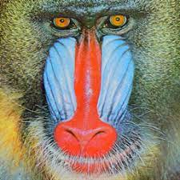

# blob-effect


## Description

- This software applies a blob effect to images.
  - It randomly positions a specified number of blobs on the input image.
  - The size of each blob is determined randomly within a defined radius range.
- It connects the points using a spline curve, calculated based on a complex formula, to create and render the blob effect.

## Demo

|     |            Input            |               Output               |
| :-: | :-------------------------: | :--------------------------------: |
|  1  |   |   |
|  2  |  |  |

|     | Parameter | Value(min/max) |
| :-: | :-------: | :------------: |
|  1  | blob_num  |      1500      |
|     |  radius   |      5/20      |
|     |   dense   |     10/100     |
|     | thickness |      1/1       |
|  2  | blob_num  |      500       |
|     |  radius   |      5/30      |
|     |   dense   |     10/50      |
|     | thickness |      1/1       |

## Getting Started

### 1. Clone & Prepare .env

```sh
$ git clone https://github.com/nglcobdai/blob-effect.git
$ cd blob-effect
```

### 2. Create .env

- copy .env.example to .env

```sh
$ cp .env{.example,}
```

### 3. Docker Build & Run

```sh
docker-compose build --no-cache
docker-compose up -d
docker-compose exec project-blob-effect bash
```

### 4. Run Project

- normal run

  ```sh
  python3 src/main.py
  ```

- optional arguments

  ```sh
  python3 src/main.py --config config --img demo1.png
  ```

  |  Option  |   Default   | Description                                          |
  | :------: | :---------: | :--------------------------------------------------- |
  | --config |  `config`   | config file path<br>reference `./src/cfg/config.yml` |
  |  --img   | `demo1.png` | image file path<br>reference `./data/demo1.png`      |
