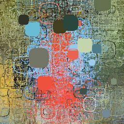

# blob-effect

|                 |                                                                                                                                                                                                                                                                                                                                                                                                                                                                                    |
| --------------- | ---------------------------------------------------------------------------------------------------------------------------------------------------------------------------------------------------------------------------------------------------------------------------------------------------------------------------------------------------------------------------------------------------------------------------------------------------------------------------------- |
| **License**     |                                                                                                                                                                                                                                                                                                                                                                                                            |
| **Environment** |  <br>   <br>   |
|                 |                                                                                                                                                                                                                                                                                                                                                                                                                                                                                    |

## Description

- This software applies a blob effect to images.
  - It randomly positions a specified number of blobs on the input image.
  - The size of each blob is determined randomly within a defined radius range.
- It connects the points using a spline curve, calculated based on a complex formula, to create and render the blob effect.

## Requirements

- Docker and docker-compose are required. The versions are as follows.

  - `Docker`: `v26.0.2`
  - `Docker Compose`: `v2.22.0`

## Demo

|     |            Input            |               Output               |
| :-: | :-------------------------: | :--------------------------------: |
|  1  |   |   |
|  2  |  |  |

## Getting Started

### 1. Clone Repository

```sh
$ git clone -b v1.1.2 https://github.com/nglcobdai/blob-effect.git
$ cd blob-effect
```

### 2. Create .env

- copy .env.example to .env

```sh
$ cp .env{.example,}
```

### 3. Docker Build & Run

```sh
$ docker-compose build --no-cache
$ docker-compose up -d
$ docker-compose exec project /bin/bash
```

### 4. Run Project

run with `./cfg/demo1.yml`

```sh
$ python3 blob_effect/main.py -c demo1
```

|      Option       | Default | Description                                     |
| :---------------: | :-----: | :---------------------------------------------- |
| `-c` / `--config` | `demo1` | config file path<br>reference `./cfg/demo1.yml` |

- If you want to run with another config file, please prepare it in `./cfg/` directory.
  - Rules for writing config files are [here](./docs/config-rule.md).
- If you want to run with another image file, please prepare it in `./data/` directory.
